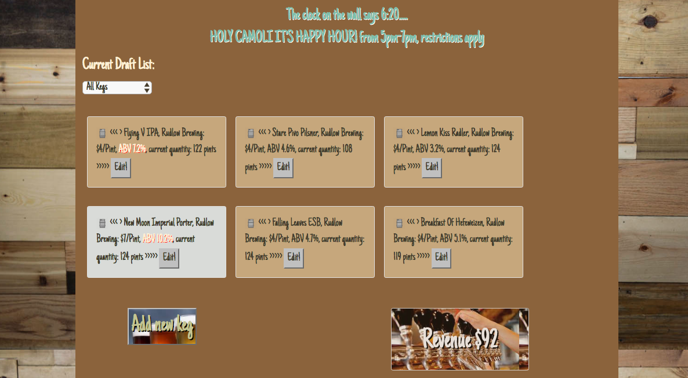

# Rudlow Brewing

_AngularJS 2.0 Project for Epicodus, 08.17.2017_

By _Calla Rudolph & Jake Ruleaux_

This website has been deployed for easy viewing: https://rudlow-brewing.firebaseapp.com

## Description
This AngularJS 2.0 app is for the Rudlow Brewing Co. It displays a list of current kegs with their name, brand, price, ABV %, and quantity. The user can add new kegs and edit existing kegs. A click of the keg icon will pour a pint, which increases the total revenue and decreases the quantity for that keg. Happy hour is between 2pm and 4pm, where the price of each pint will automatically lower by $1. Kegs may be sorted by ABV strength. When a keg's quantity gets below 10 pints, an alert will appear. When the keg is empty, pints can no longer be sold.

_This image is a screenshot of the splash page during happy hour_

## Installation

* Open Github site in your browser: https://github.com/CallaRudolph/js-taproom
* Select green drop-down box to Clone or Download
* Open Terminal on your computer and follow these steps:
  * `$ cd desktop`
  * `$ git clone <paste repository-url>`
  * `$ cd js-taproom`
  * `$ npm install`
  * `$ bower install`
  * `$ ng build`

## Development server

Run `ng serve` for a dev server. Navigate to `http://localhost:4200/`. The app will automatically reload if you change any of the source files.

## Technologies Used

AngularJS 2.0, Node.js, Bootstrap, CSS, HTML

_This project was generated with [Angular CLI](https://github.com/angular/angular-cli) version 1.0.0._

## Code scaffolding

Run `ng generate component component-name` to generate a new component. You can also use `ng generate directive/pipe/service/class/module`.

## Build

Run `ng build` to build the project. The build artifacts will be stored in the `dist/` directory. Use the `-prod` flag for a production build.

## Running unit tests

Run `ng test` to execute the unit tests via [Karma](https://karma-runner.github.io).

## Running end-to-end tests

Run `ng e2e` to execute the end-to-end tests via [Protractor](http://www.protractortest.org/).
Before running the tests make sure you are serving the app via `ng serve`.

## Further help

To get more help on the Angular CLI use `ng help` or go check out the [Angular CLI README](https://github.com/angular/angular-cli/blob/master/README.md).

## License

Copyright &copy; 2017 `Calla Rudolph & Jake Ruleaux`

This software is licensed under the MIT license.
